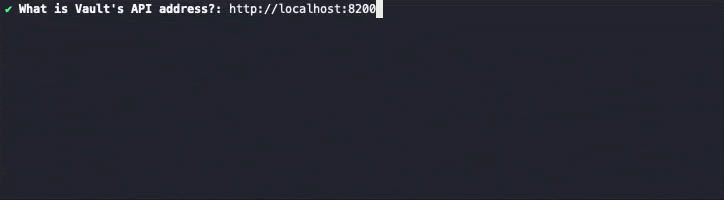

# Generating the Configuration File

The tool supports a `generate-config` subcommand which triggers a step-by-step wizard.
This wizard then asks questions to build up the configuration file.

An example of this can be seen below.



It can be started by running `vvw generate-config -f OUTPUT_FILE_PATH`, substituting in the desired output path.

```
$ vvw help generate-config
Builds up a config file suitable for use with the apply command by asking questions about the Vault setup

Usage:
  vvw generate-config [flags]

Flags:
  -h, --help   help for generate-config

Global Flags:
  -f, --configFile string   Path to config file to use to configure Venafi Vault plugin (default "vvw_config.hcl")
```

For certain questions, an environment variable can be used with the dollar-sign syntax used by bash, e.g. `$VAR_NAME`.
This gets translated into `env("VAR_NAME")` in the config file.
However, this only works with questions that make sense for an environment variable, such as API keys and TPP authentication details.